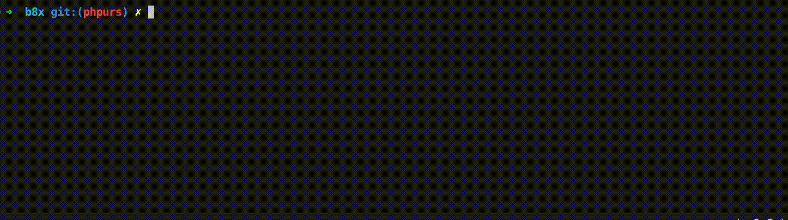

# Fullstack PureScript architecture: a public POC

> A real world, production ready product built entirely in [PureScript](https://www.purescript.org/). Still a WIP, but mature enough to be public.

This repository is the (public shareable part of the) engine behind [v2.books.actualitte.com](https://v2.books.actualitte.com) (the modern successor to the legacy [WordPress website](https://books.actualitte.com)). 

This is a WIP, sometimes stuck in infinite loading (when I do DevOps stuff), with odd/half-baked/ugly things in certain parts of the code. Anyway... My primary intention with this project is to demonstrate that **coding a large-scale, real world web application in PureScript is not only possible, but immensely enjoyable and robust.** It aims to help move PureScript beyond its perceived "experimental" status and serves as a comprehensive, living guide to the aspects that matter most to everyday web developers.

---

## ✨ The philosophy: safety first, no implicit hell

Move just one tiny letter of something critical in the business logic (e.g. `by @"id" ...` -> `by @"if" ...`), and the compiler will immediately refuse your change. 

Everything is built with uncompromising safety in mind. **Types are explicit**, constraints come afterwards, and there is no "implicit hell". If it compiles, you can deploy with a peace of mind that you will slowly start to consider as the new normal.

## 🏗️ Architecture & patterns

This project is a showcase of interesting architectural patterns applied in a pure functional language:

*   **100% PureScript (Isomorphic):** From the Node.js backend to the Frontend UI and background workers, (almost) everything is written in PureScript.
*   **Hexagonal architecture (ports & adapters) / SOLID:** Implemented the FP way (quite powerful!), originally inspired by [this article](https://deque.blog/2017/07/06/hexagonal-architecture-a-less-declarative-free-monad/), but taken a step further thanks to the advent of modern, specialized libraries that improve the approach. Interfaces (Ports) are designed using Algebraic Effects and the Free Monad pattern. They are interpreted into actual side effects at the very last moment, exclusively in the `Inter` entrypoints (e.g., via specialized monads like `ApiM`).
    *   `src/Core`: The pure business logic, heavily isolated from the outside world.
    *   `src/Infra|Inter`: The adapters (UI, API, CLI, Workers).
*   **Event sourcing & CQRS:** The state of the application is a sequence of events. Commands and Projections are strictly separated. Thanks to the chosen FP approach of the Hexarch philosophy (i.e. Algebraic Effects, Free Monad pattern...), the separation of concerns still is absolute: even the Projections and their Finders are defined as completely pure, algebraic constructs in the Core, without a single trace of concrete implementation (e.g., SQL). They are built using a pure micro-DSL (with operations like `add`, `del`, `update`) and naturally live in the Core, close to their Features.
*   **Domain driven design (DDD):** Using [Rico-Fritzsche-style](https://blog.ricofritzsche.de) modeling to ensure the code reflects the actual business needs. There's a lot to say on how Rico see DDD, and I strongly encourage you to read the blog.
*   **Pragmatic infrastructure:** Designed with strong financial constraints in mind, optimized for Disk usage over RAM (PostgreSQL, robust File System caching, RabbitMQ).

## 💡 Interesting techniques

This codebase explores interesting concepts:

*   **Custom prelude (`Proem`) & symbolic functions:** A deeply customized prelude (`Proem`) replaces standard verbose functions with math/Greek/Latin-inspired symbols for extreme conciseness. For example, `compose` becomes `◁`, `const` is `κ`, and `pure` is `η` (typing them is effortless thanks to simple VS Code snippets that automatically expand standard names into their symbolic counterparts). Once familiar, it makes reading data-pipelines super visual.
*   **Type level programming (RowList):** Deep use of PureScript's type-level capabilities (like `RowList` and zero-cost coercion) to reduce boilerplate. For instance, creating automated PostgreSQL indexes or validating event payloads at compile-time without writing repetitive code.
*   **Extensible effects with `Run`:** To manage side-effects cleanly and composably, the application leans on the `Run` monad (an implementation of algebraic effects). This avoids rigid monad transformer stacks, keeping effect definitions explicit, isolated, and easy to interpret.
*   **Polymorphic variants for exceptions:** Instead of using a generic `Error` type or throwing unchecked exceptions, the codebase models business errors using `Variant` (polymorphic variants). This brings compile-time exhaustiveness guarantees to error handling: the compiler knows exactly which exceptions a function can yield and forces the caller to handle them explicitly.
*   **Zero cost abstractions (`Newtype`) & phantom types:** Massive use of PureScript's `Newtype` class alongside phantom types ensures rigorous compile-time type safety (e.g., tracking business states without adding runtime fields) while keeping the representation as raw JavaScript primitives. This enables maximum performance and seamless FFI/JSON integration with zero runtime overhead.
*   **Type driven & homegrown full text search:** The application features a custom-built search engine powered entirely by PostgreSQL (no Elasticsearch). It natively handles typos (via trigrams), accents, casing, and joined words, while leveraging advanced weighting (using Postgres A/B/C/D weight classes) for extreme relevance. Furthermore, the projection engine uses type-level metadata (e.g., `FullTextSearchable` newtypes) to automatically generate and maintain the necessary `tsvector` indexes and weights without manual SQL migrations.
*   **Robust type refinement & sanitization (DTO free):** Every base domain type (e.g., `Email`) is strictly refined and encapsulates its own sanitization rules. This exact same principle applies at the structural level for Command Fields. By combining field-level and type-level sanitization, the application easily tolerates, cleans, and normalizes messy external inputs (like inconsistent JSON payloads) right at the system's edge. This completely eliminates the need to maintain a layer of DTOs (Data Transfer Objects), at least as long as API versions do not start to pile up.
*   **Custom typed GQL-like API engine:** Instead of relying on a standard GraphQL server, the project implements a homegrown, strictly typed API engine inspired by GQL. It goes a step further by providing extreme precision for business needs, such as explicitly encoding the exact *reason* why a field was "nullified" (e.g., unauthorized vs. not found) directly in the type system, ensuring bulletproof frontend consumption.
*   **Type safe CSS in PS DSL:** The UI doesn't rely on brittle string-based CSS classes. Styling is tightly coupled to components and heavily leverages custom symbolic combinators (like `:|>` or `|*¨`) to guarantee that DOM structure and styling logic never drift apart. *(Note: much of the frontend codebase is currently "speed first" and still messy. A clean example demonstrating a natural tree structure, similar to SASS, can be found here: [`src/Inter/Ui/Router/Menu/Core/Items/Item/Style/Style.purs`](https://github.com/0x000000000000000000001/b8x.pub/blob/main/src/Inter/Ui/Router/Menu/Core/Items/Item/Style/Style.purs))*.

## ⚡ Performance & scale

The architecture isn't just about safety and type-level guarantees; it's also built for extreme speed and resource efficiency. A recent load test (high traffic simulation) yielded staggering results:

*   **Before (legacy system):** Struggled to serve pages in 5 seconds with a maximum concurrency of 10 users/sec (crashing beyond that).
*   **Now (PureScript/event sourced):** Serving pages in **70 microseconds** with a parallelism of **1500 reqs/sec**.

**What does this mean at scale?**
*   **Optimal capacity:** ~110 million reqs/day, translating to ~60 million users/day (or 1.6 billion users/month).
*   **Pessimistic capacity (peak heavy traffic):** ~22 million reqs/day (~11 million users/day), scaling to ~648 million reqs/month (~324 million users/month).

These metrics rival major national newspapers, yet the entire stack runs effortlessly on a minuscule, budget friendly server (**2 CPU cores, 8GB RAM**)—hardware less powerful than a standard laptop! 

This level of performance guarantees extreme financial predictability. Server upgrades won't be necessary for the foreseeable future, ensuring that the only growing cost will be image storage (a few extra cents per year).

_Note: same story for backend API calls, with a factor going from 0.2 to 0.7, depending on the endpoint._

## 🌐 Runtime agnostic in the real world

To prove that this universal multi-runtime abstraction is not just theoretical, it has been successfully tested against the test suite of a real-world project (`b8x`). 

As demonstrated below, you can seamlessly switch from the Node.js backend to the PHP backend, **or even to a natively compiled Go backend (`gopurs`)**. After swapping the backend target, the entire test suite runs without requiring a single change to the PureScript application code. Even better, there is absolutely no need for complex setups: PHP runs with its own native event loop and HTTP server (no PHP-FPM needed), and the Go backend compiles into a single, ultra-lightweight native binary that starts instantly.

Tests:

<div align="center">
  
</div>

UI & API:

<div align="center">
  <video src="https://github.com/user-attachments/assets/bed48187-70b3-4886-9f68-af76516a8c6d" autoplay loop muted playsinline width="100%"></video>
</div>

One of the most interesting takeaways from this experiment is the performance gap on a real-world application. While raw computational micro-benchmarks show massive differences (with Go natively crushing V8, and V8 outperforming PHP), the gap narrows significantly on a real project where I/O and database interactions are the primary bottlenecks. In our real-world test suite, the execution took **~1.5s on PHP, ~1.3s on Node, and ~[X.X]s on Go**. The database remains the great equalizer, but Go still provides unmatched concurrency handling (`goroutines`), near-zero memory footprint, and instant cold starts.

For a deeper dive into this concept, you can read the full article: [The ultimate polymorphism: PureScript as a universal language](https://dev.to/0x1/the-ultimate-polymorphism-purescript-as-a-universal-language-5gdi).

## 🗄️ Event sourcing architecture (PostgreSQL native)

b8x relies on a highly optimized, PostgreSQL-native event sourcing architecture designed to handle FAANG-level scale and extreme concurrency, powered by a lock-free, mathematically proven **Context Collision Observer (CCO)**.

The core philosophy is to completely decouple physical infrastructure limits from business logic, offering a seamless developer experience while maintaining strict ACID guarantees.

### 1. The lock-free CCO (write side)

To prevent the Write Skew anomaly under high load, the architecture evaluates overlaps contextually, allowing strictly independent contexts (e.g., "Alice" vs "Bob") to execute in pure parallel:

*   **The Intent Registry (UNLOGGED)**: Before appending, a transaction registers its append "intent" (a `JSONPath` filter representing the context it depends on, plus the incoming events) in a tiny, ephemeral in-memory `UNLOGGED` table. Thanks to Little's Law, this registry stays incredibly small (e.g., ~30 rows even at 15,000 reqs/sec), making native C-level sequential scans lightning fast.
*   **Bidirectional check & Enriched Atomic CTE**: The collision check is pushed directly into the final `INSERT` (the OCC statement). The database takes an atomic snapshot and checks two things simultaneously:
    1. **Sequence Check**: Is the expected version still correct?
    2. **Bidirectional CCO Check**: Do my events trigger someone else's registered `JSONPath` filter? OR do their incoming events trigger mine?
    If an overlap is detected, the `INSERT` safely returns 0 rows. The application cleanly rolls back, re-fetches the latest state, and retries.
*   **The Sieve (DDoS protection)**: Under massive contention on a *single* context (e.g., a "Flash Sale"), the system natively counts active collisions in the registry before opening an application transaction. If the limit is reached, it fails-fast natively. This protects the main database pool from connection exhaustion and acts as a surgical DDoS shield.
*   **Zombie Garbage Collection**: To prevent crashed servers from leaving "zombie" intents in the registry, each intent uses a session-level heartbeat lock (`pg_advisory_lock`). If a new transaction encounters a collision, it checks the heartbeat (`pg_try_advisory_lock`). If dead, the zombie is silently cleared.

### 2. Mega-OCC (Optimistic batching)

While the lock-free CCO drastically reduces transaction locking, processing 10,000 parallel commands still generates 30,000 network roundtrips.

To push throughput beyond physical TCP and context-switching limits, the architecture implements optimistic batching (Mega-OCC):
*   **The Mega-Intent**: An application-level buffer groups up to 100 requests. It dynamically combines their contexts using a `JSONPath` `||` operator and registers a single mega-intent in the registry.
*   **The Batched Lock-Free Insert**: A single JSON payload containing the 100 expected states is sent to the database. The enriched CTE unpacks the payload, checks all 100 expected versions, and evaluates the mega-intent against the bidirectional registry in one pass. If the condition holds true, it performs a single `INSERT` that writes all 100 events at once.
*   **Atomized Fallback**: If a single context in the batch fails the check (e.g., collision), the mega-OCC rolls back instantly. The application then gracefully falls back to sequential atomized execution for this specific batch to isolate the faulty transaction.

This optimization compresses thousands of network roundtrips and database transactions into a fraction of the cost, comfortably achieving tens of thousands of events per second on a single instance.

### 3. TxID ratchet & gap detector (read side)

Because events are inserted asynchronously using a `BIGSERIAL` primary key, sequence numbers can technically be committed out of order due to OS thread preemption or network jitter.

*   **The Ratchet (`pg_snapshot_xmin`)**: To guarantee strict, gapless consumption, the Projections (global subscribers) filter the event stream using PostgreSQL's native transaction visibility horizon. The system will wait and refuse to process a "newer" event as long as an "older" transaction is still active. This silently and elegantly handles 99% of out-of-order commits.
*   **The Gap Detector**: For the rare remaining cases, the Gap Detector notices the non-contiguous sequence jump, pauses the cursor, and briefly waits for the missing transaction to commit or roll back.
*   **Physical Isolation**: For the Ratchet to work safely, read models MUST be written to a completely separate database instance (`edge`). This prevents a slow projection write from freezing the `xmin` horizon of the primary event store (`store`).

### 4. Connection multiplexing (two pool architecture)

To maximize throughput without hitting CPU context switching bottlenecks, the database connections are strictly multiplexed via **PgBouncer** (used as a Latency Multiplier):

*   `store` (tx_pool): For heavy event polling and appending.
*   `store-lock` (lock_pool): Dedicated strictly to the CCO heartbeat locks, ensuring critical background session locks can always be acquired without deadlocks or starving the main transaction pool.
*   `edge`: For asynchronous projection writes.

Because the `lock_pool` strictly limits connections (e.g., 100 connections), it acts as an application-level native rate-limiter. Only 100 workers can touch the database at any given time, while the other thousands wait in memory without ever hitting the OS network stack or Postgres. The Sieve then ensures that only a tiny fraction of those workers proceed to open a heavy transaction on the `tx_pool`.

### 5. The polling winner: why not logical decoding?

While **Logical decoding** (streaming directly from the WAL via Replication Slots) might seem like the ultimate algorithmic evolution (0 lag, 0 stutters, perfect ordering), it is fundamentally unsuitable for a massive fan-out architecture where dozens of independent microservices connect directly to the database.

*   **Hard limits**: Each consumer requires a dedicated physical replication slot (PostgreSQL defaults to `max_replication_slots=10`).
*   **The WAL ticking time bomb**: A replication slot physically forbids Postgres from deleting Write-Ahead Logs (WAL) until the consumer acknowledges them. If a single microservice crashes or loses network connectivity, its orphaned slot will force Postgres to stockpile WAL files indefinitely, eventually crashing the entire database due to disk exhaustion.

By sticking to the **Ratchet XMIN (SQL polling)** approach, the architecture achieves near real-time performance safely, allowing limitless, risk-free fan-out directly from Postgres without requiring heavy external infrastructure like Kafka.

> You can find the full proof and benchmark details on this subject in the dedicated POC repository: [ccc-postgres-concurrency-proof (feat/cco branch)](https://github.com/0x000000000000000000001/ccc-postgres-concurrency-proof/tree/feat/cco), as well as the original architectural discussion [here](https://github.com/ricofritzsche/ccc-postgres-concurrency-proof/issues/1).

## 📂 Project structure

A quick glance at the repository organization, strongly inspired by the [DDX here](https://github.com/Sairyss/domain-driven-hexagon#diagram):

```text
src/
├── Core/          # The heart, the business value: Models, Events, Exceptions, and pure business logic
├── Infra/         # The infrastructure implementations of the Core contracts: DB, Cache, External API Clients, Queues
├── Inter/         # The shell, the interfaces: How the core interacts with the world
│   ├── Api/       # Backend HTTP Endpoints & Middleware
│   ├── Cli/       # Workers, Code Generators, and CLI utilities
│   └── Ui/        # Frontend (built with Halogen) - Pages, Router, Components
└── Util/          # Low-level helpers (Crypto, HTML parsers, Logging...)
```

> [!NOTE]
> **Pragmatic vertical slicing:** While the architecture is fundamentally hexagonal, a pragmatic compromise was made in favor of maximal *Vertical Slicing*. When infrastructure or interface code strictly concerns a specific business module (e.g., an `Author` feature), parts of `Infra` and `Inter` are deliberately moved inside the `Core` module's directory (inside explicit folders like `Infra/...` and `Inter/...`). This prevents excessive navigation across global folders and ensures everything related to a vertical slice is right at your fingertips when modifying business logic. The code is designed so that this type of code isn't overly extensive either (for example, indexes, utility CLI commands, etc.).


## ⚠️ Current status

Please note that this codebase is **under active development**. 

*   **The Backend** is structurally mature. The closer you get to the `Core`, the more battle-tested and refined the code is. Some peripheral elements (like specific API corners for Auth) are still being polished. Specifically, the code surrounding `MagicLink` inside the `Feat/Membership` module was written in a "speed first" manner and is currently quite messy (awaiting a proper cleanup).
*   **The Frontend** is currently functioning but contains some "speed first" coding sections that might look visually unpolished. A massive cleanup of the UI is planned very soon.
*   🤖 **A note on "messy" code:** To be transparent, practically everything that is still "dirty" or unpolished in this repository (such as the majority of the frontend, the Auth/Membership backend, etc.) is code with a **higher AI generation ratio**. It was generated quickly to reach a working state and is awaiting proper human refactoring.
*   **Expect quirks:** You might experience infinite loading (e.g., data being remigrated in the background) or odd effects as the legacy data is transitioned to the new event sourced architecture.

## 🔗 Links

*   **New platform (PureScript):** [https://v2.books.actualitte.com](https://v2.books.actualitte.com)
*   **Legacy platform (WordPress):** [https://books.actualitte.com](https://books.actualitte.com)

---
*Made with ❤️ for the PureScript community.* Have a good reading!
